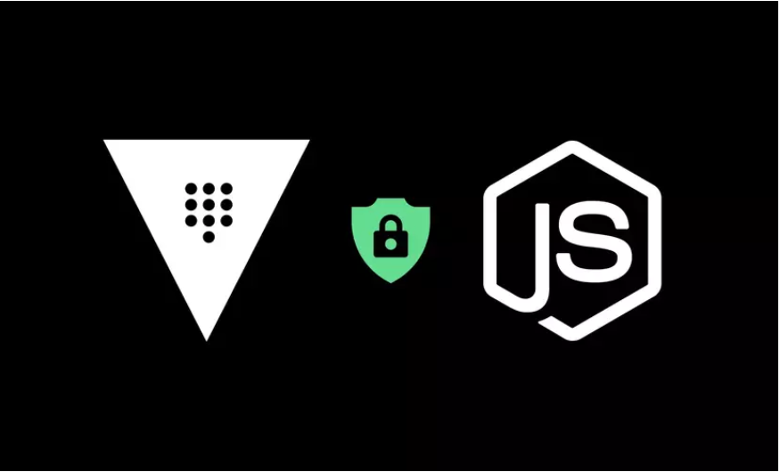
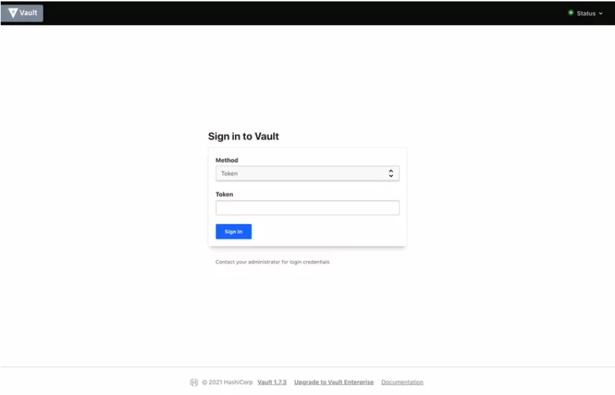
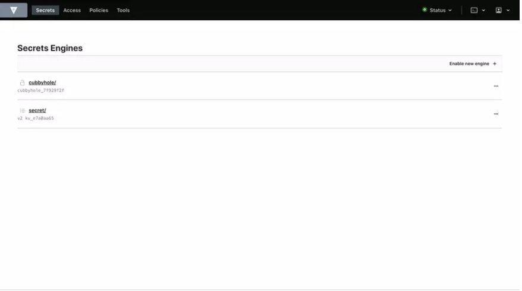
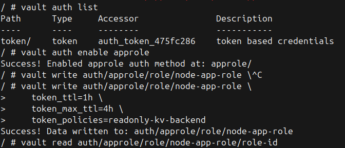

# Managing Secrets in Node.js with HashiCorp Vault (Quản lý Bí mật trong Node.js với HashiCorp Vault)
Xin chào cả nhà, chắc hẳn mọi người cũng đã nghe và được yêu cầu là bảo mật thông tin môi trường trong source của mình rồi chứ, vậy làm sao để quản lý chúng một cách an toàn và tập trung. Hôm nay chúng ta sẽ tìm hiểu một giải pháp giúp các bạn khắc phục các khó khăn một cách hiệu quả đó là HashiCorp Vault hay ngắn gọn anh em dev chúng tôi gọi nó là Vault.

### HashiCorp Vault giúp các tổ chức quản lý bí mật một cách an toàn. Tìm hiểu cách sử dụng Vault với các ứng dụng Node.js của bạn.

Khi số lượng dịch vụ trong một tổ chức tăng lên, vấn đề quản lý bí mật càng trở nên tồi tệ hơn. Giữa Zero Trust và sự xuất hiện của microservices, việc xử lý các bí mật như token, thông tin đăng nhập và khóa đã trở thành một nhiệm vụ ngày càng thách thức. Đó là lúc một giải pháp như HashiCorp’s Vault có thể giúp các tổ chức giải quyết các vấn đề quản lý bí mật của họ.

Mặc dù có các công cụ quản lý bí mật gốc của từng nhà cung cấp đám mây, việc sử dụng các giải pháp này sẽ khóa bạn với một nhà cung cấp đám mây cụ thể. Vault, mặt khác, là mã nguồn mở và di động.

Trong bài viết này, chúng ta sẽ xem xét cách HashiCorp’s Vault có thể giúp các tổ chức quản lý bí mật của họ và từ đó nâng cao tư thế an ninh mạng của họ. Sau đó, chúng ta sẽ thiết lập Vault ở chế độ dev trên máy của chúng ta và tương tác với nó qua giao diện web và CLI. Cuối cùng, chúng ta sẽ tương tác với Vault bằng cách lập trình sử dụng Node.js.

### Các Tính Năng Hàng Đầu của Vault
Vault là sản phẩm mã nguồn mở của HashiCorp để quản lý bí mật và dữ liệu nhạy cảm. Dưới đây là danh sách các tính năng hàng đầu của Vault khiến nó trở thành lựa chọn phổ biến cho quản lý bí mật:

Khái niệm tin cậy thấp và thực thi bảo mật theo danh tính được tích hợp sẵn
Mã hóa khi lưu trữ
Nhiều cách để xác thực với Vault, ví dụ: token, LDAP, AppRole, v.v.
Chính sách để quản lý mức độ truy cập của từng danh tính
Nhiều backend bí mật, mỗi cái phục vụ cho các nhu cầu cụ thể, bao gồm kho lưu trữ key-value, Active Directory, v.v.
Hỗ trợ nhiều backend lưu trữ để có tính khả dụng cao, ví dụ: cơ sở dữ liệu (MySQL, Postgres), kho đối tượng (GCS, S3), HashiCorp’s Consul, v.v.
Khả năng tạo bí mật động, chẳng hạn như thông tin đăng nhập cơ sở dữ liệu, khóa tài khoản dịch vụ đám mây (Google, AWS, Azure), chứng chỉ PKI, v.v. -** TTL và lease** tích hợp sẵn cho các thông tin đăng nhập được cung cấp
Dấu vết kiểm toán tích hợp sẵn ghi lại mọi tương tác với Vault
Nhiều cách để tương tác với dịch vụ Vault, bao gồm giao diện web, CLI, Rest API và truy cập lập trình qua các thư viện ngôn ngữ.

Những tính năng này khiến Vault trở thành lựa chọn hấp dẫn cho kiến trúc microservices dựa trên đám mây, nơi mỗi microservice sẽ xác thực với Vault một cách phân tán và truy cập các bí mật. Việc truy cập vào các bí mật có thể được quản lý cho từng microservice riêng lẻ bằng cách sử dụng các chính sách theo nguyên tắc ít quyền nhất.

Trong phần tiếp theo, chúng ta sẽ thiết lập Vault ở chế độ dev và thảo luận về các cách thiết lập nó trong môi trường sản xuất. Sau đó, chúng ta sẽ cấu hình instance Vault dev cho demo thực hành của chúng ta, học các tùy chọn cấu hình khác nhau trong quá trình này.

### Thiết Lập cho Demo Thực Hành


Chúng ta sẽ sử dụng Docker để thiết lập Vault trên máy cục bộ của chúng ta. Lưu ý rằng thiết lập này không sẵn sàng cho sản xuất. Chúng ta sẽ khởi động Vault ở chế độ dev, sử dụng tất cả các cấu hình mặc định không an toàn.

Chạy Vault trong môi trường sản xuất không dễ dàng. Để làm điều đó, bạn có thể chọn HashiCorp Cloud Platform, Vault được quản lý hoàn toàn trên đám mây, hoặc để đội ngũ hạ tầng của tổ chức bạn thiết lập một cụm Vault an toàn và có tính khả dụng cao.

### Thiết Lập cho Demo Thực Hành
Chúng ta sẽ khởi động dịch vụ Vault bằng cách sử dụng hình ảnh Docker chính thức vault:1.7.3.

Nếu bạn chạy container mà không có bất kỳ đối số nào, nó sẽ khởi động máy chủ Vault ở chế độ Dev theo mặc định.

### Khởi Động Vault ở Chế Độ Dev
Chúng ta sẽ khởi động dịch vụ Vault bằng cách sử dụng hình ảnh Docker chính thức vault:1.7.3.

Nếu bạn chạy container mà không có bất kỳ đối số nào, nó sẽ khởi động máy chủ Vault ở chế độ Dev theo mặc định.

```bash
docker run --name vault -p 8200:8200 vault:1.7.3
```
Khi Vault đang khởi động, bạn sẽ thấy một luồng nhật ký. Nhật ký nổi bật nhất là cảnh báo cho bạn biết rằng Vault đang chạy ở chế độ phát triển:

```bash
WARNING! dev mode is enabled! In this mode, Vault runs entirely in-memory and starts unsealed with a single unseal key. The root token is already authenticated to the CLI, so you can immediately begin using Vault.
```
Nếu bạn đọc kỹ thông báo, bạn sẽ nhận thấy một vài điều. Đầu tiên, nó nói rằng Vault không bị khóa với một khóa unseal duy nhất, và thứ hai, nó đề cập đến một root token. Điều này có nghĩa là gì?

Theo mặc định, khi bạn khởi động Vault ở chế độ sản xuất, nó bị khóa, nghĩa là bạn không thể tương tác với nó ngay lập tức. Để bắt đầu, bạn sẽ cần mở khóa nó và nhận các khóa unseal và root token để xác thực với Vault.

Trong trường hợp phát hiện vi phạm, máy chủ Vault có thể bị khóa lại để bảo vệ chống lại truy cập độc hại.

Thông tin khác được in trong nhật ký là root token, có thể được sử dụng để xác thực với Vault. Tùy chọn xác thực bằng token được bật theo mặc định và root token có thể được sử dụng để bắt đầu tương tác đầu tiên với Vault.

Lưu ý rằng nếu đội ngũ hạ tầng của tổ chức bạn đã thiết lập Vault, họ có thể đã bật một số backend xác thực khác như đã thảo luận trong phần trước.

Sao chép root token, vì chúng ta sẽ sử dụng nó để đăng nhập vào giao diện web của Vault.

Truy cập vào http://localhost:8200 và bạn sẽ thấy màn hình đăng nhập bên dưới trên giao diện web của Vault.

### Bật KV Secret Backend
Nhập root token của bạn (sao chép từ bước trước) và nhấn “Sign In.” Bạn sẽ được chào đón với màn hình sau.

Bạn có thể thấy rằng đã có một KV backend được bật tại đường dẫn secret. Điều này được bật mặc định ở chế độ dev.

Nếu nó không được bật trong cài đặt Vault của bạn, bạn có thể làm như vậy bằng cách nhấp vào Enable New Engine và sau đó chọn KV backend và làm theo các bước thiết lập.

Chúng ta sẽ sử dụng backend này để lưu trữ các bí mật của chúng ta và sau đó truy xuất chúng trong demo Node.js.
### Cấu Hình Phương Thức Xác Thực AppRole
Chúng ta sẽ cấu hình phương thức xác thực AppRole, mà ứng dụng Node.js của chúng ta sẽ sử dụng để truy xuất các bí mật từ backend key value của chúng ta.

Chọn Access từ menu trên cùng. Bạn sẽ thấy chỉ có phương thức token được bật.

Nhấp vào Enable New Method và chọn AppRole. Để các cài đặt mặc định và nhấp vào Enable Method.

Hoặc có thể dùng commandlline để bật Approle
```bash
vault auth enable approle
```


### Tạo Chính Sách cho Truy Cập Bí Mật
Chúng ta sẽ tạo một chính sách cho phép truy cập chỉ đọc vào KV secret backend.

Chọn Policies từ menu trên cùng và nhấp vào Create ACL Policy.

Nhập tên là readonly-kv-backend, và nhập nội dung sau cho Chính sách.
```bash
path "secret/data/mysql/webapp" {
  capabilities = [ "read" ]
}

```
Theo nguyên tắc ít quyền nhất, chính sách này sẽ chỉ cho phép truy cập đọc vào các bí mật tại đường dẫn cụ thể.

Nhấn Create Policy để lưu nó.

### Tạo AppRole cho Ứng Dụng Node.js

Chúng ta sẽ chuyển đổi và sử dụng Vault CLI để hoàn thành thiết lập demo của chúng ta. Có hai cách để truy cập Vault CLI; bạn có thể tải xuống binary Vault, hoặc bạn có thể exec vào container Vault và truy cập CLI. Đối với demo này, chúng ta sẽ sử dụng cách thứ hai.

```bash
docker exec -it vault /bin/sh

```
Chúng ta sẽ thiết lập các biến môi trường VAULT_ADDR và VAULT_TOKEN.


```bash
export VAULT_ADDR=http://localhost:8200
export VAULT_TOKEN=<ROOT TOKEN>
```
Bây giờ hãy tạo một AppRole và gắn chính sách của chúng ta vào vai trò này.

```bash
vault write auth/approle/role/node-app-role \
    token_ttl=1h \
    token_max_ttl=4h \
    token_policies=readonly-kv-backend
```
Bạn sẽ thấy nó được tạo thành công.
```bash
Success! Data written to: auth/approle/role/node-app-role
```
Mỗi AppRole có một RoleID và SecretID, giống như tên người dùng và mật khẩu. Ứng dụng có thể trao đổi RoleID và SecretID này để lấy token, sau đó có thể được sử dụng trong các yêu cầu tiếp theo.

### Lấy RoleID và SecretID
Bây giờ chúng ta sẽ lấy RoleID liên quan đến node-app-role qua lệnh sau:

```bash
vault read auth/approle/role/node-app-role/role-id
```
Tiếp theo chúng ta sẽ lấy SecretID:

```bash
vault write -f auth/approle/role/node-app-role/secret-id
```
Hãy chắc chắn rằng bạn lưu trữ các giá trị này ở nơi an toàn, vì chúng ta sẽ sử dụng chúng trong ứng dụng Node.js của chúng ta.

Lưu ý rằng không an toàn để cung cấp SecretID cho các ứng dụng của chúng ta như thế này. Bạn nên sử dụng response wrapping để cung cấp SecretID một cách an toàn cho ứng dụng của bạn. Đối với mục đích của demo này, chúng ta sẽ truyền SecretID dưới dạng biến môi trường cho ứng dụng của chúng ta.

### Quản Lý Bí Mật qua Node.js
Trong phần này, chúng ta sẽ xem cách tương tác với Vault qua Node.js và sử dụng gói node-vault để tương tác với máy chủ Vault của chúng ta.

Cài đặt gói node-vault trước, nếu chưa được cài đặt.

```bash
npm install node-vault

```
Trước khi bắt đầu, thiết lập các biến môi trường ROLE_ID và SECRET_ID để truyền các giá trị này cho ứng dụng.

```bash
export ROLE_ID=<role id fetched in previous section>
export SECRET_ID=<secret id fetched in previous section>

```

Bây giờ hãy viết ứng dụng Node mẫu.

```bash
const vault = require("node-vault")({
  apiVersion: "v1",
  endpoint: "http://127.0.0.1:8200",
});

const roleId = process.env.ROLE_ID;
const secretId = process.env.SECRET_ID;

const run = async () => {
  const result = await vault.approleLogin({
    role_id: roleId,
    secret_id: secretId,
  });

  vault.token = result.auth.client_token; 
  const { data } = await vault.read("secret/data/mysql/webapp"); 

  const databaseName = data.data.db_name;
  const username = data.data.username;
  const password = data.data.password;

  console.log({
    databaseName,
    username,
    password,
  });

  console.log("Attempt to delete the secret");

  await vault.delete("secret/data/mysql/webapp"); 
};

run();
```

ưu tập lệnh này dưới dạng index.js và chạy nó qua lệnh node index.js.

Nếu mọi thứ được thiết lập đúng cách, các bí mật của bạn sẽ được in trên màn hình của bạn. Ngoài các bí mật của bạn, bạn cũng sẽ thấy lỗi khi xóa bí mật. Điều này xác nhận rằng AppRole của chúng ta chỉ có quyền truy cập đọc bí mật và không có quyền xóa.

### Kết Luận
Trong bài viết này, chúng ta đã thấy tầm quan trọng của việc có một trình quản lý bí mật trong kiến trúc hệ thống phân tán. Chúng ta cũng đã học cách truy cập Vault qua các ứng dụng Node.js, truy xuất bí mật và giao diện với Vault qua giao diện web và CLI để cấu hình nó cho ứng dụng mẫu của chúng ta.

Từ backend lưu trữ đến backend xác thực, Vault đi kèm với rất nhiều tùy chọn để bạn có thể điều chỉnh nó hoàn hảo theo nhu cầu của tổ chức bạn. Nếu bạn đang tìm kiếm một giải pháp quản lý bí mật cho các thách thức kiến trúc microservices của mình, HashiCorp’s Vault nên đứng đầu danh sách của bạn.
